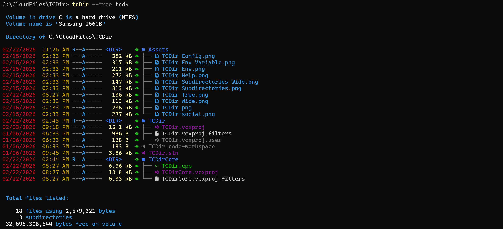

# TCDir

TCDir ("Technicolor Directory") is a fast, colorized directory listing tool for Windows consoles.
It’s designed as a practical `dir`-style command with useful defaults (color by extension/attributes, sorting, recursion, wide output, and a multi-threaded enumerator).

Hat tip to [Chris Kirmse](https://github.com/ckirmse) whose excellent [ZDir](https://github.com/ckirmse/ZDir) from the '90s was the original inspiration for TCDir.

## Requirements

- Windows 10/11
- PowerShell 7 (`pwsh`) to run the build/test scripts
- Visual Studio 2026 (v18.x)
  - The free Community edition is fine, but any edition will work
  - Workload: **Desktop development with C++**
  - Individual components (usually included with the workload, but worth confirming):
    - **MSVC v14x x64/x86 build tools**
    - **Windows 10/11 SDK**
    - **C++ unit test framework** (to build/run the `UnitTest` project)
    - Optional (ARM64 builds/tests): **MSVC v14x ARM64 build tools**
  - The scripts use `vswhere.exe` to locate MSBuild and the test runner
- Optional: VS Code (the repo includes `.vscode/` tasks wired up to `scripts/Build.ps1` and `scripts/RunTests.ps1`)

## Quick start

Build:

- Visual Studio: open `TCDir.sln` and **Build Solution**
- VS Code: run a build task (e.g. **Build Release x64 (no test)**)
- Command line: `pwsh -NoProfile -ExecutionPolicy Bypass -File .\scripts\Build.ps1 -Configuration Release -Platform x64 -Target Build`

Run:

- `.\x64\Release\TCDir.exe`

## Usage

Show help:

- `TCDir.exe -?`

Basic syntax:

- `TCDIR [drive:][path][filename] [-A[[:]attributes]] [-O[[:]sortorder]] [-S] [-W] [-B] [-P] [-M] [--Env] [--Config]`

Common switches:

- `-A[:]<attributes>`: filter by file attributes
- `-O[:]<sortorder>`: sort results
  - both `-oe` and `-o:e` forms are supported
  - `N` name, `E` extension, `S` size, `D` date/time
  - prefix `-` to reverse
- `-T:<timefield>`: select which timestamp to display and sort by
  - `C` creation time, `A` last access time, `W` last write time (default)
- `-S`: recurse into subdirectories
- `-W`: wide listing format
- `-B`: bare listing format
- `-P`: show performance timing information
- `-M`: enable multi-threaded enumeration (default); use `-M-` to disable
- `--Owner`: display file owner (DOMAIN\User format)
- `--Streams`: display NTFS alternate data streams
- `--Env`: show `TCDIR` environment variable help/syntax/current value
- `--Config`: show current color configuration

### Attribute filters (`/A:`)

Standard attributes: `D` (directory), `H` (hidden), `S` (system), `R` (read-only), `A` (archive)

Cloud sync attributes (OneDrive, iCloud, etc.):
- `O` - cloud-only placeholder files (not locally available)
- `L` - locally available files (hydrated, can be dehydrated)
- `V` - pinned/always available files (won't be dehydrated)

Extended attributes:
- `X` - not content indexed (excluded from Windows Search)
- `I` - integrity stream enabled (ReFS only)
- `B` - no scrub data (ReFS only)
- `F` - sparse file
- `U` - unpinned (allow dehydration)

Use `-` prefix to exclude (e.g., `/A:-H` excludes hidden files).

### Cloud file visualization

When browsing cloud-synced folders (OneDrive, iCloud Drive, etc.), TCDir displays sync status symbols:
- `○` (hollow) - cloud-only placeholder, not available offline
- `◐` (half) - locally available, can be dehydrated
- `●` (solid) - pinned, always available offline

Examples:
- Recurse through subdirectories: `TCDir.exe -s`

- Wide listing: `TCDir.exe -w`

## Configuration (TCDIR environment variable)

TCDir supports customizing colors (and default switch behavior) via the `TCDIR` environment variable.

Syntax:

- PowerShell: `$env:TCDIR = "[<Switch>] | [<Item> | Attr:<fileattr> | <.ext>] = <Fore> [on <Back>][;...]"`
- CMD: `set TCDIR=[<Switch>] | [<Item> | Attr:<fileattr> | <.ext>] = <Fore> [on <Back>][;...]`

**Note**: Switch names in the TCDIR variable do NOT include prefixes (`/`, `-`, `--`). Use just the switch name (e.g., `W`, `Owner`, `Streams`).

### Default switches

Enable default switches by including the switch name:

- `W` - enable wide listing by default
- `S` - enable subdirectory recursion by default
- `P` - enable performance timing by default
- `M` - enable multi-threading by default (already on by default)
- `B` - enable bare listing by default
- `Owner` - display file ownership by default
- `Streams` - display NTFS alternate data streams by default

### Color customization

Configure colors for display items, file attributes, and extensions:

### Color customization

Configure colors for display items, file attributes, and extensions:

Example:

- PowerShell: `$env:TCDIR = "W;D=LightGreen;S=Yellow;Attr:H=DarkGrey;.png=Black on Magenta"`
- CMD: `set TCDIR=W;D=LightGreen;S=Yellow;Attr:H=DarkGrey;.png=Black on Magenta`

Decoded breakdown of the example:

- `W` sets the default switch `/W` (wide listing) on
- `D=LightGreen` sets the **Date** display item color to LightGreen
- `S=Yellow` sets the **Size** display item color to Yellow
- `Attr:H=DarkGrey` sets the **Hidden** file attribute color to DarkGrey
- `.png=Black on Magenta` sets the `.png` extension color to black text on a magenta background

Display items for color configuration:
- `D` (Date), `S` (Size), `N` (Name), `Attr` (Attributes)
- `CloudOnly`, `Local`, `Pinned` - cloud sync status symbol colors

File attribute colors (`Attr:<letter>`):
- `H` (hidden), `S` (system), `R` (read-only), `D` (directory)

- Here's an example of the default output, setting the TCDIR environment variable, then showing its effects:

To see the full list of supported colors and a nicely formatted explanation, use --Env.  
- Any errors in the TCDIR variable are shown at the end.
- `TCDir.exe --Env`:

To see your current color configuration, use --Config:
- All configuration settings are displayed along with the source of that configuration.
- `TCDir.exe --Config`:

## Building

### Build options

- Visual Studio: open `TCDir.sln` and **Build Solution**
- VS Code: the repo includes `.vscode/` (tasks/launch/settings), with tasks wired up to `scripts/Build.ps1` and `scripts/RunTests.ps1`
- Command line: use the PowerShell build scripts below

### Build scripts

- Build: `pwsh -File .\scripts\Build.ps1 -Configuration <Debug|Release> -Platform <x64|ARM64> -Target Build`
- Clean: `pwsh -File .\scripts\Build.ps1 -Configuration <Debug|Release> -Platform <x64|ARM64> -Target Clean`
- Rebuild: `pwsh -File .\scripts\Build.ps1 -Configuration <Debug|Release> -Platform <x64|ARM64> -Target Rebuild`
- Build both Release targets: `pwsh -File .\scripts\Build.ps1 -Target BuildAllRelease`

Build outputs land under:

- `x64\Debug\TCDir.exe`, `x64\Release\TCDir.exe`
- `ARM64\Debug\TCDir.exe`, `ARM64\Release\TCDir.exe`

## Tests

Run unit tests:

- `pwsh -File .\scripts\RunTests.ps1`

(Uses Visual Studio’s `vstest.console.exe`, discovered via `vswhere`.)

## Versioning

The build number is auto-incremented by a pre-build script. Details are in BUILD_VERSION.md.

## License

MIT License. See `LICENSE`.
